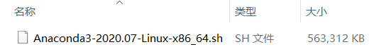

# **Ubuntu下配置Anaconda**
*主页：https://github.com/wjxpro*

*邮箱：804359553@qq.com*

[TOC]

## 〇、Anaconda是什么？

Anaconda是用于科学计算的**Python发行包**。里面不仅包含了Python的解释器和标准库（可能不是最新版）、常用的第三方库（`numpy`、`scipy`、`openpyxl`等）、自带的包管理工具`conda`，在Windows环境下的安装包还集成了几大常用的IDE（`Jupyter`、`Spyder`等）。<b><font color='red'>一句话，想用Python，装Anaconda就对了。</font></b>（小字：安装包也就500M左右，如果嫌大或者不需要那么多东西可以装Miniconda，流程差不多。）

## 一、安装Anaconda
### 1. 下载安装包
去[清华大学开源软件镜像站](https://mirrors.tuna.tsinghua.edu.cn/)下载所需版本的Anaconda安装包。安装包位置在镜像站的`镜像列表`->`anaconda`->`archive/`，进入后请按日期筛选，找到最新版本点击下载，这里以`Anaconda3-2020.07-Linux-x86_64.sh`为例（.sh是linux的可执行文件）。


### 2. 两个小问题
+ 为什么用清华镜像？因为帮助写的好，配源省事，不嫌麻烦也可以用阿里（听说比较快）、豆瓣、中科大等。
+ 我应该选择哪个版本？一般选择最新版本就好，其包含的Python和第三方库比较新，如果需要用到旧版的库，可以直接创建虚拟环境，在虚拟环境中安装旧版库。

### 3. 安装流程
**安装时可以按照以下示例进行选择。**
在普通用户下打开终端，用`cd`命令进入到下载好的安装包的路径，然后输入：
```shell
bash Anaconda3-2020.07-Linux-x86_64.sh
```
<b><font color='red'>注意</font></b>：此处不要在root用户下也不要使用sudo命令，否则安装的Anaconda软件所有者是root用户，普通用户无法直接使用python命令。

一路回车。其中几个选项可以按下述方法配置：
```shell
Do you accept the license terms? [yes|no]
[no] >>> 
Please answer 'yes' or 'no':'
```
输入`yes`，回车。接受协议。
```shell
Anaconda3 will now be installed into this location:
/home/${xxx}/anaconda3

  - Press ENTER to confirm the location
  - Press CTRL-C to abort the installation
  - Or specify a different location below
```
回车。安装到默认路径，即当前登录用户的`home`目录下。
```shell
Do you wish the installer to initialize Anaconda3
by running conda init? [yes|no]
```
`yes`，回车。启动终端默认激活Anaconda的`base`环境，否则默认不启动。
```shell
If you'd prefer that conda's base environment not be activated on startup, 
   set the auto_activate_base parameter to false: 

conda config --set auto_activate_base false

Thank you for installing Anaconda3!

===========================================================================

Working with Python and Jupyter notebooks is a breeze with PyCharm
Professional! Code completion, Notebook debugger, VCS support, SSH, Docker,
Databases, and more!

Get a free trial at: https://www.anaconda.com/pycharm
```
至此，安装完成。

## 二、配置环境变量
安装完成后，在终端中输入`python -V`查看python版本，会提示：
```shell
-bash: python: command not found
```
这是因为python还未添加到环境变量中。环境变是用来定义每个用户的操作环境，在用户使用诸如`python`的用户命令时，可以找到执行此命令对应的程序。

在终端上直接输入以下命令可以**临时设置**环境变量：
```shell
export PATH=$PATH:/home/${user_name}/anaconda3/bin
```
通常，可以通过修改环境变量配置文件`/etc/profile`或者`/etc/bashrc`或者`~/.bashrc`（详见[Ubuntu环境变量.md](Ubuntu环境变量.md)），达到**永久设置**环境变量的目的。

这里我们修改`profile`文件（此文件属于系统文件，要使用`sudo`获取root权限才能修改），输入：
```shell
sudo vi /etc/profile  # 或者vim（使用方法请自行查找）

# 如果有图形界面的话，也可以
sudo gedit /etc/profile
```
输入密码后进入文件，在文件的末尾加上以下代码：
```
#Anaconda（这行是注释）
export PATH=$PATH:/home/${user_name}/anaconda3/bin
```
此处路径根据自己anaconda安装路径更改（主要是更改路径中的用户名），然后保存并退出。

最后重新载入配置文件，需要注销当前用户再登录（重启也行），如果是远程服务器则需要重新连接一下，或者使用`source`命令临时激活修改后的配置文件，输入：
```shell
source /etc/profile
```
完成上述步骤，环境变量就配置好了。此时再输入`python -V`查看python版本，可以看到：
```
Python 3.8.3
```
## 三、设置国内镜像源
**（不另外安装第三方库可以暂时不设置）**
### 1. 介绍
Python的社区很庞大，这与他自带的、超好用的包管理工具`pip`密切相关。而Anaconda附带的包管理工具`conda`，又因为集成了虚拟环境的管理，而在工程项目中应用甚广。但是，这两个工具默认的下载网址是官网，也就是国外网站，安装第三方包的时候会特别慢。所以伟大的劳动人民创建了“镜像站”这种东西，就是把国外的软件、库之类的先搬到国内的服务器，我们再访问该服务器，由于只经国内路由，因此能达到更快的下载速度。

常用的镜像站主页：
+ <a href="https://mirrors.tuna.tsinghua.edu.cn/" target="-blank" title="清华大学开源软件镜像站"><font size=4><b>清华大学开源软件镜像站 </b></font></a>
+ <a href="https://developer.aliyun.com/mirror/" target="-blank" title="阿里云官方镜像站">阿里云官方镜像站 </font></a>
+ [中国科学技术大学开源软件镜像站](https://mirrors.ustc.edu.cn/)

### 2. 方法
一般就使用清华大学镜像站（因为界面好看【误】）。具体配置方法请在镜像站主页点击“相关链接”下的“使用帮助”，找到`anaconda`配置`conda`源，找到`pypi`配置`pip`源。

#### 永久配置`pip`源命令
**在终端中输入以下命令：**
```shell
pip config set global.index-url https://pypi.tuna.tsinghua.edu.cn/simple
```
之后会在对应系统下自动生成相应配置文件，其所在位置如下：
> + windows: C:\Users\${USER_NAME}\AppData\Roaming\pip\pip.ini
> + Ubuntu: ~/.config/pip/pip.conf

其内容如下：
```bash
[global]
index-url = https://pypi.tuna.tsinghua.edu.cn/simple
```

#### 其它`pip`源
> 豆瓣：http://pypi.douban.com/simple/
清华：https://pypi.tuna.tsinghua.edu.cn/simple/
阿里云：http://mirrors.aliyun.com/pypi/simple/
中国科技大学：https://pypi.mirrors.ustc.edu.cn/simple/
中国科学技术大学：http://pypi.mirrors.ustc.edu.cn/simple/
华中理工大学：http://pypi.hustunique.com/
山东理工大学：http://pypi.sdutlinux.org/

#### `pip`源注意
如使用http地址的源，可以在配置文件下添加内容避免`trusted-host`警告。以使用http地址的阿里源为例：
```bash
[global]
index-url = http://mirrors.aliyun.com/pypi/simple/

[install]
trusted-host = mirrors.aliyun.com
```

#### `conda`源注意
> 如果需要安装`PyTorch`，要在`default_channels:`后面加上：
` - https://mirrors.tuna.tsinghua.edu.cn/anaconda/cloud/pytorch`
注意保持格式一致。

### 3. 其他注意点
#### 下载包失败
通过`conda`下载包时，有可能出现下载失败，可以在配置路径时，把`https`改成`http`（见下1），或者手动下载包，然后离线安装（见下2）。

210225更新：
按如下1操作后，创建虚拟环境失败，改回https就好了。

参考链接：
1. [解决清华源依旧安装慢或者安装失败](https://blog.csdn.net/qq_37828380/article/details/110443197)
2. [亲测绝对有效——解决pytorch安装下载慢(清华源+缓存到本地)](https://blog.csdn.net/qq_44722174/article/details/104800082?utm_medium=distribute.pc_relevant.none-task-blog-OPENSEARCH-1.control&depth_1-utm_source=distribute.pc_relevant.none-task-blog-OPENSEARCH-1.control)


#### 在root用户下配置了Anaconda，但是使用非root用户登录后无法使用

原因是普通用户权限低，无法使用root用户环境。解决方法是输入`su root`并输入密码，永久获取root权限，成功后即可使用Python。或者不获取root权限，而在每条需要权限的命令前添加`sudo`命令，即临时获取root权限。  
还有一种解决方法，即在其中一个普通用户内重新配置环境，并设置环境变量，但是非常麻烦，不推荐使用。方法如下：  
[Ubuntu多用户Anaconda环境配置](https://blog.csdn.net/BOTAK_/article/details/95476101)


## 四、使用
### 1. 简单使用
> + Python解释器：Python解释器在安装根目录下的`python`，在终端中输入`python`实际就是运行了它。
> + `Jupyter Notebook`：高级的Python交互式运行环境，需要使用浏览器打开。详见[Jupyter Notebook使用教程](../Python/Jupyter_Notebook使用教程.md)
> + `Spyder`：仿`Matlab`的Python IDE。
> ...

### 2. 包管理
**（在终端中输入命令）**
```shell
# 使用pip安装第三方库
pip install ${package_name} [-i https://pypi.tuna.tsinghua.edu.cn/simple]  # -i：指定下载所用的镜像站
# 例：
pip install numpy

# 使用conda安装第三方库
conda install ${package_name}
# 例：
conda install numpy
```

### 3. `pip`与`conda`
`conda`优点：安装第三方库时会检查环境，减少安装后失败可能；导出requirements时会记下安装时使用的网址，方便迁移环境；拥有虚拟环境管理...
`conda`缺点：可用镜像站少，下载速度可能不如`pip`；检查环境耗时；配置镜像源需要注意...
`pip`优点：Python自带的；镜像站多，下载快...
`pip`缺点：迁移环境不靠谱...

### 4. 虚拟环境
详见[conda虚拟环境的使用.md](../开发环境/conda虚拟环境的使用.md)