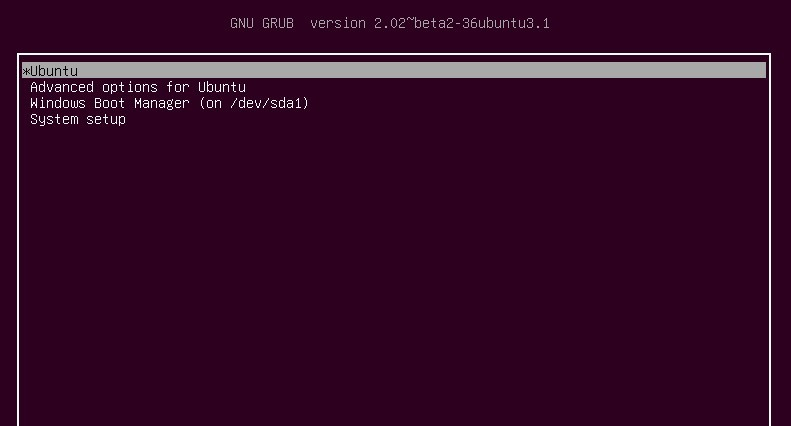

# **Ubuntu服务器维护**
*主页：https://github.com/wjxpro*

*邮箱：804359553@qq.com*

[TOC]

## 维护人员必会
### 1. 进入grub引导界面
重启后，如果为单系统，在进入`ubuntu`的logo界面时，按<kbd>Esc</kbd>进入`grub`引导界面。如果为双系统，则会自动引导至`grub`界面。如下图所示：



### 2. 在安全模式下使用root用户
在`grub`引导界面，选择高级模式，然后选择对应内核版本的安全模式，等待加载完成，最后选择`root shell`，输入密码进入root命令行。

### 3. 使用`try ubuntu`改回
对于因修改系统关键文件导致的系统崩溃，可以按照安装系统的步骤，进入`ubuntu`系统盘的`try ubuntu`模式，将原系统中修改的文件改回。

在`try ubuntu`中，首先使用`sudo passwd`获取`sudo`权限，然后打开`文件管理`，选择`其它位置`，找到原系统所在盘，之后右键打开终端，进行修改。

## 关闭更新
### 小说明
普通用户可以不关闭，但如果是开发者，最好关掉保持环境稳定。

永远不要更新gcc版本！！！需要使用其它版本时，不要删除原版，另外安装后更改下默认。记得之后改回来。

### 关闭系统更新
修改配置文件：
```bash
sudo gedit /etc/apt/apt.conf.d/10periodic
```
０是关闭，1是开启，将所有值改为0。

### 关闭内核更新
```bash
sudo apt-mark hold linux-image-generic linux-headers-generic 
```

## 选择内核版本启动
如果更新未关闭完全，可能会自动下载新版内核，然后在某次重启之后自动选择新版内核启动，导致各种驱动都会出bug。这时候不要慌，可以尝试选择版本较旧的内核重新启动。
### 图形界面操作
在grub引导界面选择`Advanced options for Ubuntu`后，进入其子菜单，选择一更新前内核版本或者较老的硬核版本，然后等待重启即可。
### 命令行操作
```bash
sudo gedit /etc/default/grub
```
根据需要修改下面一行内容：
```bash
GRUB_DEFAULT="1> 4"
# 注：1 代表主菜单的第二项Advanced options for Ubuntu；4代表1项目下面对应的子菜单里面的第5项
```
输入以下命令适用更改：
```bash
sudo update-grub
```

## 常见问题
### 1. *无法使用make编译，出现makefile: XXXXXXX failed*
如安装CUDA在编译`deviceQuery`时，提示：
```shell
g++: No such file or directory
Makefile:288: recipe for target 'deviceQuery.o' failed
make: *** [deviceQuery.o] Error 1
```
需要安装g++：
```shell
sudo apt-get install libncurses5-dev
```

### 2. *几分钟自动断网*
在`/etc/ppp/options`中，注释掉`Icp-echo-failure 4`和`Icp-eco-interal 30`。这两是向服务器发送询问，所以将两个注释掉就能阻止发送询问，就不会造成断网。
```shell
sudo gedit /etc/ppp/options
```
    # Icp-echo-failure 4
    # Icp-eco-interal 30
