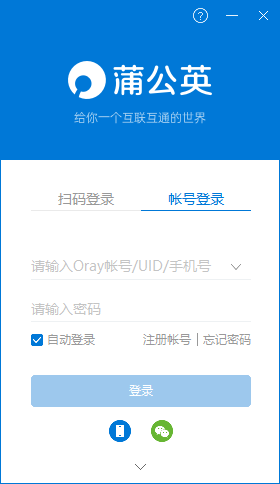
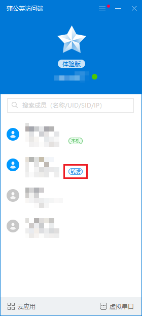

# **Ubuntu服务器远程使用**
*主页：https://github.com/wjxpro*

*邮箱：804359553@qq.com*

[TOC]

## 一、简介
“SSH是较可靠，专为远程登录会话和其他网络服务提供安全性的协议。” ——来自百度百科

在用户机能通过IP地址找到服务器的情况下，可以使用SSH连接上服务器。简而言之，当你需要使用一台主机访问另一台主机时，就会用到它。这件事情通常发生在访问Linux主机的时候，这是因为Windows默认不支持SSH服务，而Linux很容易安装SSH服务。

## 二、服务端配置SSH
首先检查服务器是否开启了ssh服务，使用命令：
```shell
sudo ps -e | grep ssh
```
如果安装了的是会有sshd服务的，如果没有任何输出或者只有`ssh-agent`则是没有安装ssh服务。

### 下面是SSH的安装方法
先更新apt资源列表，使用命令：
```shell
sudo apt update
```
安装openssh-server，使用命令：
```shell
sudo apt install openssh-server
```
继续输入`sudo ps -e | grep ssh`，看到如下信息则说明安装成功：

> 99999（进程号）&ensp;?&ensp;&ensp;&ensp;&ensp;&ensp;&ensp;&ensp;&ensp;00:00:00&ensp;<font color='red'>ssh</font>d

## 三、在客户端使用
Windows用户可以使用cmd连接服务器，也可以使用一些第三方shell软件，如Xshell、MobaXterm等，还可以使用VS Code进行远程调试。

### 使用Xshell
详见[Xshell使用教程.md](../开发环境/Xshell使用教程.md)

### 使用VS Code进行远程调试
详见[VS Code远程调试.md](../开发环境/VS_Code远程调试.md)

## 四、找到服务器IP的方法
### 情况一：服务器和用户机在一个局域网下
在服务器终端输入：
```bash
ipconfig  # Windows服务器

ifconfig  # Linux服务器
# 可能需要安装net-tools才能使用此命令
sudo apt install net-tools
```
在显示的信息中找到主机的IPv4地址。

### 情况二：服务器和用户机不在一个局域网下
需要自行搭建局域网，使用`蒲公英`可快速地在多个设备间搭建起**对等网络**（免费版只有3个）。
#### 蒲公英官网
<a href="https://pgy.oray.com/" target="-blank" title="蒲公英SD-WAN">
 <span style="color: #b1b1b1;">蒲公英</span></a>

#### 服务端配置
1. 注册贝锐科技账号，进行简单配置；
2. 下载并安装**与服务器系统一致**的版本；
3. 安装完成后，终端输入：
```sh
sudo pgyvpn
```
4. 从蒲公英账号下分配的三个登录账号中，选择**其中一个账号**在服务器端登录，第一次使用会显示如下（可能为英文）：
```sh
================= 上海贝锐(Oray) =================
	            蒲公英VPN (Linux)			
		           Ver 2.2.1				
==================================================
请输入帐号或UID：
XXXXXXXX:XXX  # 输入UID
请输入密码：
# 输入密码不会显示
是否自动登录？[y/n](默认为y)
y  # 或者直接按回车
登录中.....
登录成功！
~~~~~~~~~~~~~~~~~~~请输入以下指令~~~~~~~~~~~~~~~~~
1,getmbrs:	获取组成员信息			
2,bypass:	查看旁路路由			
3,chgacnt:	更换帐号			
4,showsets:	查看所有设置			
5,prtinfo:	显示实时信息（组成员变动）			
6,noinfo:	不显示实时信息			
7,slang:	切换语言(change language)		
8,qservice:	退出并关闭VPN服务			
9,quit:		退出VPN界面			
~~~~~~~~~~~~~~~~~~~~~~~~~~~~~~~~~~~~~~~~~~~~~~~~~~
```
5. 输入`9`，退出前台界面。

> **注**：服务器重启或断网重联之后，需要重新输入`sudo pgyvpn`命令重启蒲公英。
#### 客户端配置
下载并安装蒲公英：

选择与**服务器不同的UID**登录。

登录后，可以看到有服务器端的转发IP，则**使用此转发IP**即可连接服务器。
